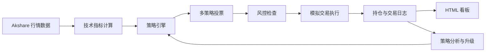

# AI Trading System

基于 OpenClaw AI Agent 构建的 A 股模拟交易系统，覆盖行情获取、指标计算、策略回测、多策略决策、风险控制、模拟执行、交易日志、可视化看板和策略自迭代。

## 功能概览

- 获取 A 股大盘、个股行情、K 线和涨幅榜
- 内置双均线、RSI、布林带、趋势跟随等策略
- 支持历史回测和网格参数优化
- 提供多策略投票决策和风险控制
- 支持本地模拟账户、持仓管理、买入卖出和盈亏计算
- 生成 HTML 看板展示资产、持仓、交易和日记摘要
- 支持 Windows 定时任务周期执行交易循环

## 系统架构



## Agent 工作流

每一轮交易由 `TradingAgent` 调度：

1. 获取大盘概况和标的行情
2. 读取当前持仓、现金、总资产和盈亏
3. 运行技术指标和策略信号
4. 结合多策略投票输出买入、卖出或持有
5. 执行回撤、连亏、仓位等风控检查
6. 进行模拟交易或保持观望
7. 写入交易日记和交易记录
8. 根据近期胜率和盈亏判断是否升级策略版本

## 核心模块

| 模块 | 作用 |
|------|------|
| `core/data_feed.py` | akshare 行情数据层，获取指数、个股、K 线和涨幅榜 |
| `core/strategy_engine.py` | 策略定义、技术指标、回测和网格参数优化 |
| `core/decision_engine.py` | 多策略加权投票、仓位计算和风险控制 |
| `core/paper_trader.py` | 模拟买卖、持仓管理、盈亏计算和交易日志 |
| `core/trading_agent.py` | 主 Agent 循环、交易复盘和策略自迭代 |
| `core/dashboard.py` | HTML 可视化看板生成 |

## 环境要求

| 依赖 | 版本 | 用途 |
|------|------|------|
| Python | 3.10+ | 运行环境 |
| akshare | 1.18.60+ | A 股实时行情 |
| pandas | 2.0+ | 数据处理 |
| numpy | 1.24+ | 数值计算 |
| ta | 0.11+ | 技术指标 |
| OpenClaw | 2026.5+ | Agent 平台，可选 |

## 快速开始

```powershell
cd AITradingSystem
pip install -r requirements.txt

.\run.ps1 init
.\run.ps1 market
.\run.ps1 quote -Symbol 600519.SH
.\run.ps1 run
.\run.ps1 dashboard
```

如数据源访问受限，可设置代理：

```powershell
$env:AI_TRADING_PROXY="http://127.0.0.1:7897"
```

## 命令总览

| 命令 | 作用 |
|------|------|
| `.\run.ps1 init` | 初始化模拟账户 |
| `.\run.ps1 market` | 查看大盘概况 |
| `.\run.ps1 quote -Symbol 600519.SH` | 查询个股行情 |
| `.\run.ps1 buy -Symbol 600519.SH -Quantity 100` | 模拟买入 |
| `.\run.ps1 sell -Symbol 600519.SH -Quantity 100` | 模拟卖出 |
| `.\run.ps1 portfolio` | 查看持仓 |
| `.\run.ps1 journal` | 查看交易日记 |
| `.\run.ps1 run` | 执行一次完整交易循环 |
| `.\run.ps1 evolve` | 分析并升级策略 |
| `.\run.ps1 backtest -Symbol 600519.SH` | 回测策略 |
| `.\run.ps1 dashboard` | 打开可视化看板 |

## 目录结构

```text
AITradingSystem/
├── core/
│   ├── data_feed.py
│   ├── strategy_engine.py
│   ├── decision_engine.py
│   ├── paper_trader.py
│   ├── trading_agent.py
│   └── dashboard.py
├── data/
├── docs/
├── logs/
├── scripts/
│   └── trade_cycle.bat
├── strategies/
├── requirements.txt
├── run.ps1
└── README.md
```

`data/` 和 `logs/` 中的运行态文件默认不会提交到 GitHub。

## 数据层

| 函数 | 返回值 | 说明 |
|------|--------|------|
| `get_market_overview()` | `dict` | 大盘指数，如上证、深证、创业板 |
| `get_realtime_quote(symbol)` | `dict` | 个股实时行情 |
| `get_kline(symbol, period, count)` | `dict` | K 线数据，支持 daily、weekly、monthly |
| `get_top_gainers(top_n)` | `list` | 涨幅榜 |

股票代码示例：

- `600519.SH`: 贵州茅台
- `000001.SZ`: 平安银行
- `300750.SZ`: 宁德时代

## 策略引擎

内置策略均支持回测和参数优化。

| 策略 | 参数 | 逻辑 |
|------|------|------|
| 双均线交叉 | `fast=5`, `slow=20` | 快线上穿慢线买入，下穿卖出 |
| RSI | `oversold=30`, `overbought=70` | RSI 低于超卖阈值买入，高于超买阈值卖出 |
| 布林带 | `period=20`, `std_dev=2` | 价格触及下轨买入，触及上轨卖出 |
| 趋势跟随 | ADX、成交量、高低点排列 | 趋势强度和成交量共同确认 |

`core/decision_engine.py` 中的 `EnsembleStrategy` 会汇总趋势跟随、均线交叉、RSI 和布林带信号，再由 `DecisionEngine` 做风控过滤。

## 回测和参数优化

```python
from core.strategy_engine import MaCrossStrategy, backtest, grid_search_optimize
from core.data_feed import get_kline
import pandas as pd

df = pd.DataFrame(get_kline("600519.SH", count=120)["data"])

result = backtest(df, MaCrossStrategy(5, 20))
print(result["total_return_pct"], result["win_rate"])

params = [
    {"fast": f, "slow": s}
    for f in [3, 5, 10]
    for s in [15, 20, 30, 60]
]
best = grid_search_optimize(df, MaCrossStrategy, params)
print(best["best_params"], best["best_return"])
```

## 添加新策略

在 `core/strategy_engine.py` 中新增策略类，并实现 `generate_signals(self, df)` 方法。输出 DataFrame 需要包含 `trade` 列：

- `1`: 买入
- `-1`: 卖出
- `0`: 持有

```python
class MyStrategy:
    def __init__(self, period=10):
        self.period = period
        self.name = f"MyStrategy({period})"

    def generate_signals(self, df):
        df = df.copy()
        df["signal"] = 0
        df.loc[df["close"] > df["close"].rolling(self.period).mean(), "signal"] = 1
        df.loc[df["close"] <= df["close"].rolling(self.period).mean(), "signal"] = -1
        df["trade"] = df["signal"].diff().fillna(0)
        return df
```

## 模拟交易和风控

`core/paper_trader.py` 提供本地模拟交易能力，包括账户初始化、买入卖出、持仓管理、盈亏统计、交易记录和交易日记。

| 风控项 | 说明 |
|--------|------|
| 最大回撤 | 回撤超过阈值时停止交易 |
| 连续亏损 | 最近交易连续亏损时暂停 |
| 单笔风险 | 控制每笔交易的最大风险敞口 |
| 仓位计算 | 使用保守的 Kelly-inspired sizing |

策略自迭代流程：

```text
交易循环 -> 记录日记 -> 分析胜率和盈亏 -> 触发策略升级 -> 保存 data/strategy_v*.json
```

## 可视化看板

`core/dashboard.py` 会生成暗色主题 HTML 页面，展示总资产、总盈亏、可用现金、大盘指数、当前持仓、最近交易记录和交易日记摘要。

```powershell
.\run.ps1 dashboard
```

生成文件位于 `data/dashboard.html`。

## Windows 定时任务

```batch
schtasks /create /tn "AITradingSystem" /tr "cmd.exe /c path\to\AITradingSystem\scripts\trade_cycle.bat" /sc minute /mo 5 /f
schtasks /delete /tn "AITradingSystem" /f
schtasks /change /tn "AITradingSystem" /disable
schtasks /change /tn "AITradingSystem" /enable
```

A 股交易时间通常为周一至周五 9:30-11:30、13:00-15:00，节假日休市。

## 本地数据和隐私

本地运行会生成以下文件：

- `data/portfolio.json`
- `data/trading_journal.json`
- `data/dashboard.html`
- `data/strategy_v*.json`

这些文件可能包含持仓、交易记录、时间戳和策略版本信息，默认已通过 `.gitignore` 排除。

## 常见问题

### 数据获取失败怎么办？

确认网络可以访问 akshare 数据源。如需要代理，设置 `AI_TRADING_PROXY` 后重新执行命令。

### 如何重置模拟账户？

```powershell
Remove-Item data\portfolio.json,data\trading_journal.json -ErrorAction SilentlyContinue
.\run.ps1 init
```

### 定时任务不运行怎么办？

检查 Windows 任务计划程序，确认任务已启用，并确认任务中的项目路径与本机实际路径一致。

## 参考与致谢

本项目在 Agent 工作流、A 股数据接入、模拟交易流程、趋势策略和行情监控设计上参考了 ClawHub 技能市场中的相关技能：

- `china-stock-analysis`: A 股分析 workflow 参考
- `a-stock-paper-trade`: 模拟交易流程与 akshare 用法参考
- `auto-trading-strategy`: 趋势跟踪与风控策略设计参考
- `stock-watcher`: 行情监控流程参考

本项目使用了以下 Python 开源库：

- `akshare`: A 股行情与历史数据接口
- `pandas` / `numpy`: 数据处理与数值计算
- `ta`: 技术指标计算

## 后续规划

- 接入券商量化接口，如 xtquant
- 增加消息通知和异常告警
- 拆分为行情、策略、风控、执行、复盘多 Agent 协作
- 增加绩效统计、最大回撤、Sharpe 等指标
- 增加单元测试和回归测试

## 风险声明

本项目仅用于技术研究和模拟交易演示，不构成任何投资建议。真实交易存在价格波动、流动性、滑点、延迟和执行偏差等风险，请自行判断。

## 参考链接

- [akshare 文档](https://akshare.akfamily.xyz/)
- [OpenClaw 文档](https://docs.openclaw.ai)
