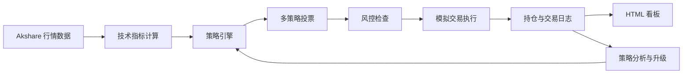

# AI Trading System

基于 OpenClaw AI Agent 构建的 A 股模拟交易系统，覆盖行情获取、指标计算、策略回测、多策略决策、风险控制、模拟执行、交易日志、可视化看板和策略自迭代。

## 项目定位

这是一个面向研究、展示和原型验证的 agent-driven trading sandbox。它把原本分散的盯盘、分析、下单、复盘和调参流程，收敛成一个可重复执行的 Agent 闭环。

## 在线演示

- GitHub 仓库: [AITradingSystem](https://github.com/ma3203947426/AITradingSystem)
- 演示页: `https://ma3203947426.github.io/AITradingSystem/`

## 核心痛点

个人投资者或量化策略开发者通常需要在行情软件、表格、脚本、交易记录和复盘笔记之间来回切换，容易出现决策滞后、参数试错效率低、缺少复盘闭环、交易纪律不稳定等问题。本项目通过 Agent 主循环把数据、策略、风控、执行和复盘串起来，让策略可以被持续验证和迭代。

## 核心能力

- 实时获取 A 股大盘、个股行情、K 线和涨幅榜
- 内置双均线、RSI、布林带、趋势跟随等策略
- 支持历史回测和网格参数优化
- 提供多策略投票决策和风险控制
- 支持本地模拟账户、持仓管理、买入卖出和盈亏计算
- 自动写入交易日记，并根据胜率和盈亏触发策略升级
- 生成 HTML 看板，用于展示资产、持仓、交易和日记摘要
- 支持 Windows 定时任务周期执行交易循环

## 系统架构



## Agent 工作流

每一轮交易由 `TradingAgent` 统一调度：

1. 获取大盘概况和标的行情
2. 读取当前持仓、现金、总资产和盈亏
3. 运行技术指标和策略信号
4. 结合多策略投票输出买入、卖出或持有
5. 执行回撤、连亏、仓位等风控检查
6. 进行模拟交易或保持观望
7. 写入交易日记和交易记录
8. 根据近期胜率和盈亏判断是否升级策略版本

## 核心模块

| 模块 | 作用 |
|------|------|
| `core/data_feed.py` | akshare 行情数据层，获取指数、个股、K 线和涨幅榜 |
| `core/strategy_engine.py` | 策略定义、技术指标、回测和网格参数优化 |
| `core/decision_engine.py` | 多策略加权投票、仓位计算和风险控制 |
| `core/paper_trader.py` | 模拟买卖、持仓管理、盈亏计算和交易日志 |
| `core/trading_agent.py` | 主 Agent 循环、交易复盘和策略自迭代 |
| `core/dashboard.py` | HTML 可视化看板生成 |

## 环境要求

| 依赖 | 版本 | 用途 |
|------|------|------|
| Python | 3.10+ | 运行环境 |
| akshare | 1.18.60+ | A 股实时行情 |
| pandas | 2.0+ | 数据处理 |
| numpy | 1.24+ | 数值计算 |
| ta | 0.11+ | 技术指标 |
| OpenClaw | 2026.5+ | Agent 平台，可选 |

## 安装依赖

```bash
pip install -r requirements.txt
```

如数据源访问受限，可设置代理：

```powershell
$env:AI_TRADING_PROXY="http://127.0.0.1:7897"
```

## 快速开始

```powershell
cd AITradingSystem

# 初始化模拟账户，默认 100000 虚拟资金
.\run.ps1 init

# 查看大盘
.\run.ps1 market

# 查询个股行情
.\run.ps1 quote -Symbol 600519.SH

# 执行一次完整交易循环
.\run.ps1 run

# 打开可视化看板
.\run.ps1 dashboard
```

## 命令总览

| 命令 | 作用 |
|------|------|
| `.\run.ps1 init` | 初始化模拟账户 |
| `.\run.ps1 market` | 查看大盘概况 |
| `.\run.ps1 quote -Symbol 600519.SH` | 查询个股行情 |
| `.\run.ps1 buy -Symbol 600519.SH -Quantity 100` | 模拟买入 |
| `.\run.ps1 sell -Symbol 600519.SH -Quantity 100` | 模拟卖出 |
| `.\run.ps1 portfolio` | 查看持仓 |
| `.\run.ps1 journal` | 查看交易日记 |
| `.\run.ps1 run` | 执行一次完整交易循环 |
| `.\run.ps1 evolve` | 分析并升级策略 |
| `.\run.ps1 backtest -Symbol 600519.SH` | 回测策略 |
| `.\run.ps1 dashboard` | 打开可视化看板 |

## 目录结构

```text
AITradingSystem/
├── core/
│   ├── data_feed.py
│   ├── strategy_engine.py
│   ├── decision_engine.py
│   ├── paper_trader.py
│   ├── trading_agent.py
│   └── dashboard.py
├── data/
│   ├── portfolio.json
│   ├── trading_journal.json
│   └── dashboard.html
├── docs/
│   └── index.html
├── logs/
├── scripts/
│   └── trade_cycle.bat
├── strategies/
├── requirements.txt
├── run.ps1
└── README.md
```

`data/` 和 `logs/` 中的运行态文件默认不会提交到 GitHub。

## 数据层

数据层使用 `akshare` 获取 A 股数据，不需要券商账号。

| 函数 | 返回值 | 说明 |
|------|--------|------|
| `get_market_overview()` | `dict` | 大盘指数，如上证、深证、创业板 |
| `get_realtime_quote(symbol)` | `dict` | 个股实时行情 |
| `get_kline(symbol, period, count)` | `dict` | K 线数据，支持 daily、weekly、monthly |
| `get_top_gainers(top_n)` | `list` | 涨幅榜 |

股票代码示例：

- `600519.SH`: 贵州茅台
- `000001.SZ`: 平安银行
- `300750.SZ`: 宁德时代

## 策略引擎

内置策略均支持回测和参数优化。

### 双均线交叉策略

```text
参数: fast=5, slow=20
逻辑: 快线上穿慢线买入，快线下穿慢线卖出
```

### RSI 策略

```text
参数: oversold=30, overbought=70
逻辑: RSI 低于超卖阈值买入，高于超买阈值卖出
```

### 布林带策略

```text
参数: period=20, std_dev=2
逻辑: 价格触及下轨买入，触及上轨卖出
```

### 增强决策策略

`core/decision_engine.py` 中提供多策略投票框架：

- `TrendFollowStrategy`: 趋势跟随，结合 ADX、成交量和高低点排列
- `MACrossoverStrategy`: 均线交叉，并加入长期趋势过滤
- `RSIStrategy`: RSI 超买超卖判断
- `BollingerStrategy`: 布林带挤压和反弹判断

最终由 `EnsembleStrategy` 计算加权投票结果，再由 `DecisionEngine` 进行风控过滤。

## 回测和参数优化

```python
from core.strategy_engine import MaCrossStrategy, RSIStrategy, backtest, grid_search_optimize
from core.data_feed import get_kline
import pandas as pd

df = pd.DataFrame(get_kline("600519.SH", count=120)["data"])

result = backtest(df, MaCrossStrategy(5, 20))
print(f"收益率: {result['total_return_pct']}%")
print(f"胜率: {result['win_rate']}%")

params = [
    {"fast": f, "slow": s}
    for f in [3, 5, 10]
    for s in [15, 20, 30, 60]
]

best = grid_search_optimize(df, MaCrossStrategy, params)
print(f"最优参数: {best['best_params']}")
```

## 添加新策略

在 `core/strategy_engine.py` 中新增策略类，并实现 `generate_signals(self, df)` 方法。输出 DataFrame 需要包含 `trade` 列：

- `1`: 买入
- `-1`: 卖出
- `0`: 持有

```python
class MyStrategy:
    def __init__(self, period=10):
        self.period = period
        self.name = f"MyStrategy({period})"

    def generate_signals(self, df):
        df = df.copy()
        df["signal"] = 0
        df.loc[df["close"] > df["close"].rolling(self.period).mean(), "signal"] = 1
        df.loc[df["close"] <= df["close"].rolling(self.period).mean(), "signal"] = -1
        df["trade"] = df["signal"].diff().fillna(0)
        return df
```

## 模拟交易

`core/paper_trader.py` 提供纯本地模拟交易能力，不需要券商账号。

功能包括：

- 初始化模拟账户
- 买入和卖出股票
- 持仓管理
- 总资产、现金和盈亏统计
- 交易记录和交易日记

数据存储在 `data/portfolio.json` 和 `data/trading_journal.json`。

## 风控机制

| 风控项 | 说明 |
|--------|------|
| 最大回撤 | 回撤超过阈值时停止交易 |
| 连续亏损 | 最近交易连续亏损时暂停 |
| 单笔风险 | 控制每笔交易的最大风险敞口 |
| 仓位计算 | 使用保守的 Kelly-inspired sizing |

## 策略自迭代机制

```text
每轮交易循环 -> 记录日记 -> 分析胜率和盈亏
  -> 胜率低于阈值或总盈亏为负
  -> 自动升级策略版本
  -> 保存 data/strategy_v*.json
  -> 继续下一轮循环
```

## 可视化看板

`core/dashboard.py` 会生成暗色主题 HTML 页面，展示：

- 总资产、总盈亏、可用现金
- 大盘指数
- 当前持仓
- 最近交易记录
- 交易日记摘要

打开方式：

```powershell
.\run.ps1 dashboard
```

也可以直接打开本地生成文件：`data/dashboard.html`。

## 接入真实交易

当前项目默认只做模拟交易。后续可通过替换 `paper_trader.py` 中的执行层接入真实交易。

### 方案 A: 对接券商量化接口

| 券商或平台 | 接口 | 难度 | 说明 |
|------------|------|------|------|
| 华泰 | xtquant | 中 | 需开通量化权限 |
| 中信 | iQuant | 中 | 通常需要机构或量化权限 |
| 通达信 | 公式交易或自动化 | 低到中 | 适合模拟下单或半自动执行 |
| 聚宽/米筐 | 云端 API | 低到中 | 适合云端策略运行 |

示例接口形态：

```python
def real_buy(symbol, price, quantity, account_id="your_account"):
    result = broker_api.place_order(
        symbol=symbol,
        side="BUY",
        order_type="LIMIT",
        price=price,
        quantity=quantity,
        account=account_id,
    )
    return result
```

### 方案 B: 桌面自动化模拟操作

对于没有开放 API 的交易客户端，可以使用 KeymouseGo 等工具录制鼠标和键盘操作，作为半自动执行层。该方案更依赖本机环境，适合演示和低频模拟。

### 方案 C: 对接 xtquant

```python
from xtquant import xtdata, xttrader
```

需要参考券商量化接口文档配置账号、交易端和权限。

## Windows 定时任务

可以用 Windows 任务计划程序定时执行交易循环：

```batch
schtasks /create /tn "AITradingSystem" /tr "cmd.exe /c path\to\AITradingSystem\scripts\trade_cycle.bat" /sc minute /mo 5 /f
schtasks /delete /tn "AITradingSystem" /f
schtasks /change /tn "AITradingSystem" /disable
schtasks /change /tn "AITradingSystem" /enable
```

A 股交易时间通常为周一至周五 9:30-11:30、13:00-15:00，节假日休市。

## 本地数据和隐私

本地运行会生成以下文件：

- `data/portfolio.json`
- `data/trading_journal.json`
- `data/dashboard.html`
- `data/strategy_v*.json`

这些文件属于运行态产物，可能包含持仓、交易记录、时间戳和策略版本信息，默认已通过 `.gitignore` 排除，不会上传到 GitHub。

## 可选配置

| 环境变量 | 作用 |
|----------|------|
| `AI_TRADING_PROXY` | 可选代理地址，用于访问数据源 |
| `PYTHONIOENCODING` | 推荐设为 `utf-8`，避免控制台乱码 |

示例：

```powershell
$env:AI_TRADING_PROXY="http://127.0.0.1:7897"
```

## 常见问题

### 数据获取失败怎么办？

确认网络可以访问 akshare 数据源。如需要代理，设置 `AI_TRADING_PROXY` 后重新执行命令。

### 控制台乱码怎么办？

`run.ps1` 默认设置了 UTF-8 输出。如果仍然乱码，可以在当前终端执行：

```powershell
$env:PYTHONIOENCODING="utf-8"
```

### 如何重置模拟账户？

删除本地运行态数据后重新初始化：

```powershell
Remove-Item data\portfolio.json,data\trading_journal.json -ErrorAction SilentlyContinue
.\run.ps1 init
```

### 定时任务不运行怎么办？

检查 Windows 任务计划程序，确认任务已启用，并确认任务中的项目路径与本机实际路径一致。

## 后续规划

- 接入券商量化接口，如 xtquant
- 增加消息通知和异常告警
- 拆分为行情、策略、风控、执行、复盘多 Agent 协作
- 增加绩效统计、最大回撤、Sharpe 等指标
- 增加单元测试和回归测试
- 引入更完善的策略版本管理

## 风险声明

本项目仅用于技术研究和模拟交易演示，不构成任何投资建议。真实交易存在价格波动、流动性、滑点、延迟和执行偏差等风险，请自行判断。

## 参考

- [akshare 文档](https://akshare.akfamily.xyz/)
- [OpenClaw 文档](https://docs.openclaw.ai)
- [AutoClaw 视频方案](https://v.douyin.com/ftp3vfbi9v0/)

