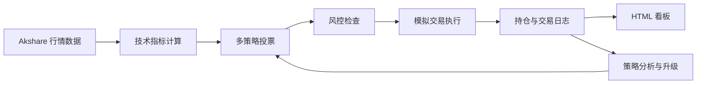

# AI Trading System

基于 OpenClaw AI Agent 构建的 A 股模拟交易系统，覆盖行情获取、指标计算、策略回测、多策略决策、风险控制、模拟执行、交易日志和策略自迭代。

## 项目定位

这是一个面向研究、展示和原型验证的 agent-driven trading sandbox。它把原本分散的盯盘、分析、下单、复盘和调参流程，收敛成一个可重复执行的 Agent 闭环。

## 核心亮点

- 实时获取 A 股大盘与个股行情
- 支持双均线、RSI、布林带等策略
- 内置回测和网格参数优化
- 本地模拟账户、持仓管理与盈亏统计
- 多策略投票决策与风险控制
- 自动写入交易日记，并根据结果做策略自迭代
- 输出 HTML 看板，便于展示和复盘

## 在线演示

- GitHub 仓库: [AITradingSystem](https://github.com/ma3203947426/AITradingSystem)
- 演示页: `https://ma3203947426.github.io/AITradingSystem/`

## 系统架构



## Agent 工作流

每一轮交易由 `TradingAgent` 统一调度：

1. 拉取大盘和标的行情
2. 读取持仓和历史交易
3. 生成策略信号
4. 执行风险校验
5. 进行模拟买卖
6. 写入交易日志
7. 根据胜率和盈亏判断是否升级策略版本

## 核心模块

| 模块 | 作用 |
|------|------|
| `core/data_feed.py` | akshare 行情数据层 |
| `core/strategy_engine.py` | 策略、回测和参数优化 |
| `core/decision_engine.py` | 多策略加权决策与风险控制 |
| `core/paper_trader.py` | 模拟交易、持仓和日志 |
| `core/trading_agent.py` | 主 Agent 循环与策略自迭代 |
| `core/dashboard.py` | HTML 看板生成 |

## 功能清单

| 功能 | 说明 |
|------|------|
| 行情获取 | 获取指数、个股、K 线、涨幅榜 |
| 策略回测 | 支持历史数据回测策略表现 |
| 参数优化 | 通过网格搜索筛选更优参数 |
| 模拟交易 | 完整的买入、卖出和持仓管理 |
| 风险控制 | 回撤、连亏、仓位大小约束 |
| 策略迭代 | 根据交易结果自动升级版本 |
| 可视化看板 | 生成 HTML 页面展示资产与交易记录 |

## 命令总览

| 命令 | 作用 |
|------|------|
| `.\run.ps1 init` | 初始化模拟账户 |
| `.\run.ps1 market` | 查看大盘概况 |
| `.\run.ps1 quote -Symbol 600519.SH` | 查询个股行情 |
| `.\run.ps1 buy -Symbol 600519.SH -Quantity 100` | 模拟买入 |
| `.\run.ps1 sell -Symbol 600519.SH -Quantity 100` | 模拟卖出 |
| `.\run.ps1 portfolio` | 查看持仓 |
| `.\run.ps1 journal` | 查看交易日记 |
| `.\run.ps1 run` | 执行一次完整交易循环 |
| `.\run.ps1 evolve` | 分析并升级策略 |
| `.\run.ps1 backtest -Symbol 600519.SH` | 回测策略 |
| `.\run.ps1 dashboard` | 打开可视化看板 |

## 快速开始

```powershell
cd AITradingSystem
pip install -r requirements.txt
.\run.ps1 init
.\run.ps1 market
.\run.ps1 run
.\run.ps1 dashboard
```

## 配置说明

| 环境变量 | 作用 |
|----------|------|
| `AI_TRADING_PROXY` | 可选代理地址，用于访问数据源 |
| `PYTHONIOENCODING` | 推荐设为 `utf-8`，避免控制台乱码 |

本地运行生成的文件包括：

- `data/portfolio.json`
- `data/trading_journal.json`
- `data/dashboard.html`

这些都是运行态产物，已在 `.gitignore` 中忽略。

## 目录结构

```text
AITradingSystem/
├── core/                  # 核心代码
├── data/                  # 持仓、日志和看板
├── docs/                  # GitHub Pages 演示页
├── scripts/               # 定时任务脚本
├── strategies/            # 自定义策略
├── run.ps1                # 主启动脚本
└── README.md
```

## 风险边界

本项目仅用于技术研究和模拟交易演示，不构成任何投资建议。真实交易存在价格波动、流动性和执行偏差等风险，请自行判断。

## 路线图

- 接入券商量化接口
- 增加告警与通知能力
- 拆分为行情、决策、执行、复盘多 Agent 协作
- 增加绩效统计和对比基准
- 补充单元测试与回归测试

## 参考

- [akshare 文档](https://akshare.akfamily.xyz/)
- [OpenClaw 文档](https://docs.openclaw.ai)

